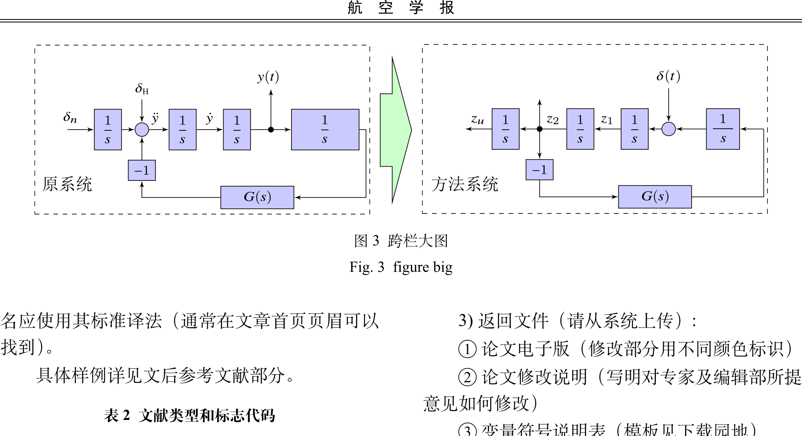

# 航空学报 LaTeX 模板（非官方）

> LaTeX template *(unofficial)* for *Acta Aeronautica et Astronautica Sinica*

本仓库是基于 [Htallone/AAAS](https://github.com/Htallone/AAAS) 的修改版，针对新版 TeX Live / XeLaTeX 环境做了兼容性修复和若干改进。**最终格式解释权归《航空学报》编辑部所有，本仓库仅供写作和排版参考。**

---

## 目录

- [项目来源](#项目来源)
- [本仓库的修改内容](#本仓库的修改内容)
- [编译环境](#编译环境)
- [快速上手](#快速上手)
- [文件结构](#文件结构)
- [许可说明](#许可说明)
- [预览](#预览)

---

## 项目来源

| 项目 | 链接 |
|------|------|
| 上游仓库 | <https://github.com/Htallone/AAAS> |
| 模板性质 | 非官方模板 |
| 原始思路 | 基于《航空学报》Word 模板整理出 XeLaTeX 可编译版本 |


## 本仓库的修改内容

相对上游版本，本仓库主要做了以下调整：

- **编译兼容性**：修复新版 TeX Live / XeLaTeX 环境下的编译错误
- **表格**：将不兼容新版 LaTeX 内核的 `tabu` 改为 `tabularx`
- **日志清理**：清理 `xelatex` / `bibtex` 编译过程中的常见警告和噪声输出
- **长 URL**：增加自动断行支持，避免参考文献超长链接撑爆版面
- **字体**：调整 `aaas.cls` 中的字体回退、页眉高度；`10.5pt` 选项作为占位符声明，不影响实际排版字号（由正文字号命令统一控制）
- **字体兼容文件**：补充本地 OT1 字体声明文件，消除旧字体编码探测造成的日志污染
- **示例保留**：保留原始示例结构、图片资源和参考文献示例，方便直接套用


## 编译环境

当前版本已在以下环境验证通过：

| 项目 | 版本 |
|------|------|
| 操作系统 | Windows |
| TeX 发行版 | TeX Live 2025 |
| 编译链 | XeLaTeX + BibTeX |

较老版本的 TeX Live 通常也可工作，但本仓库主要针对较新的 LaTeX 内核做了修复，建议使用 TeX Live 2022 及以上版本。


## 快速上手

在项目根目录依次执行以下命令（共四步）：

```bash
xelatex TempExample.tex
bibtex  TempExample
xelatex TempExample.tex
xelatex TempExample.tex
```

> 需要运行两到三遍 `xelatex` 以确保交叉引用、参考文献编号和页眉全部更新正确。

编译成功后，生成：

```
TempExample.pdf
```


## 文件结构

```
AAAS-master/
├── aaas.cls                    # 模板类文件（核心）
├── cite.sty                    # 引用格式宏包
├── OT1TimesNewRoman(0).fd      # 本地 OT1 字体兼容声明
├── TempExample.tex             # 正文示例
├── TempExample.bib             # 参考文献示例
├── Makefile                    # 跨平台构建脚本（Unix/Linux/macOS）
├── build.bat                   # Windows 一键构建脚本
├── LICENSE                     # 各组件许可说明
├── image/                      # 正文示例用图
├── Symbol/                     # 变量符号说明相关文件
├── shot1.png                   # 预览截图 1
└── shot2.png                   # 预览截图 2
```


## 快速构建

**Windows**：双击 `build.bat` 或在命令行运行：

```bash
build.bat
```

**Unix/Linux/macOS**：

```bash
make
```

均自动执行 `xelatex → bibtex → xelatex × 2`，生成 `TempExample.pdf`。


## 跨平台字体配置

模板已在 **Windows + TeX Live 2025** 环境下验证通过。以下是各平台中文字体的配置说明，如遇字体缺失请按需调整。

### Windows

TeX Live 2025 自带的基本中文字体（`SimSun`、`SimHei`、`KaiTi`、`FangSong`）通常已够用，无需额外安装。

### macOS

系统自带的中文宋体/黑体为 `.ttc` 集合字体，需要通过字体名称引用。在 `aaas.cls` 第 72–77 行附近找到 `\setCJKfamilyfont` 相关行，可参考以下映射替换：

| Windows 字体名 | macOS 等效字体名 |
|----------------|-----------------|
| `SimSun`       | `Songti SC` 或 `.STSongti-Light` |
| `SimHei`       | `STHeiti` 或 `.PingFang-SC-Regular` |
| `KaiTi`        | `STKaiti` |
| `FangSong`     | `STFangsong` |
| `STXingkai`   | `Xingkai SC` 或直接注释掉（macOS 通常无此字体）|

> 替换方式：将 `aaas.cls` 中 `\setCJKfamilyfont{hwxingkai}{STXingkai}` 行用 `%` 注释掉，同时将 `SimSun` 等替换为上表中的 macOS 名称。

### Linux（以 Ubuntu/Debian 为例）

建议使用 Noto CJK 字体：

```bash
sudo apt install fonts-noto-cjk
```

然后将 `aaas.cls` 中的 `\setCJKmainfont` 等替换为：

| Windows 字体 | Linux 等效字体 |
|-------------|---------------|
| `SimSun`    | `Noto Serif CJK SC` |
| `SimHei`    | `Noto Sans CJK SC` |
| `KaiTi`     | `Noto Serif CJK SC` |
| `FangSong`  | `Noto Serif CJK SC` |
| `STXingkai` | 注释掉或用 `Noto Serif CJK SC` 代替 |

字体安装完成后，运行 `fc-cache -f -v` 刷新字体缓存。


## 常见问题

### 1. 编译报错 "Font ... not loadable"

通常是中文字体名称与系统不匹配。检查 `aaas.cls` 中 `\setCJKfamilyfont` 和 `\setmainfont` 的字体名称是否在当前系统中存在。macOS 可用「字体册」查看准确名称，Linux 可用 `fc-list :lang=zh` 列出可用中文字体。

### 2. BibTeX 参考文献编号为问号 `[?]`

确保运行了完整的 `xelatex → bibtex → xelatex → xelatex` 四步流程。首次编译时 `.bbl` 文件尚未生成，中间两步的引用都会是 `?`。

### 3. 参考文献中出现超长 URL 撑破版面

已在 `TempExample.tex` 中引入 `xurl` 宏包，URL 会自动断行。如仍有问题，可在参考文献段落内插入 `\sloppy` 命令。

### 4. 图表浮动到意外位置

LaTeX 默认浮动算法会综合考虑页面美观。强制指定位置的写法：

```latex
\begin{figure}[h!]  % 就在此处，尽量不浮动
```

或使用 `float` 宏包的 `[H]` 选项（需加载 `\usepackage{float}`）。

### 5. 编译时有大量 OT1 字体警告

已通过 `OT1TimesNewRoman(0).fd` 文件解决。如仍有其他字体相关警告，检查 TeX Live 是否完整安装，尝试运行：

```bash
tlmgr install collection-fontsrecommended
```

### 6. 页面边距与 Word 模板不完全一致

`aaas.cls` 中页面尺寸通过 `\newgeometry` 设定（顶部 33.5mm，底部 31.5mm，左右 22mm）。如需微调，直接修改该文件第 166–169 行对应的数值即可。


## 许可说明

详见 `LICENSE` 文件。简要说明：

- **`aaas.cls`**：可自由使用、传播和修改，保留原始声明即可
- **`cite.sty`**：LPPL 许可证，详见文件内声明
- **`TempExample.tex` 及示例图片**：来源于《北航学报》和《航空学报》官方 Word 模板，版权归原期刊/作者所有
- 本仓库不对格式准确性承担任何责任，请以期刊官网最新投稿要求为准


## 预览



